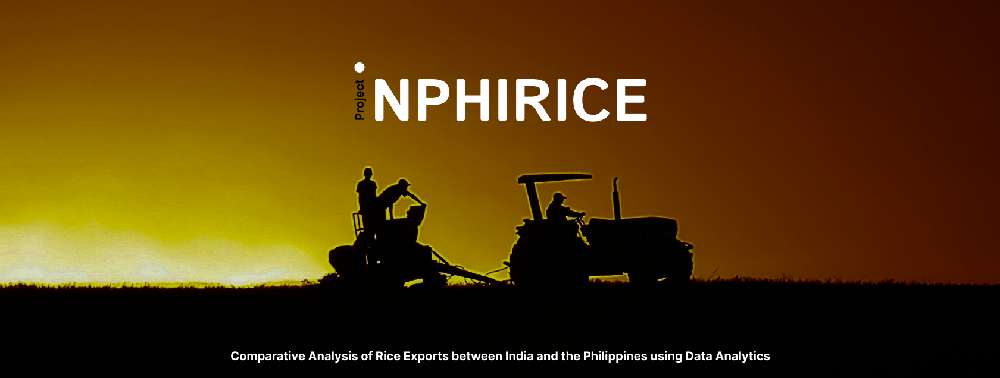

# INPHIRICE: Comparative Analysis of Rice Exports between India and the Philippines using Data Analytics

This project is a comparative analysis between the agriculture of India and the Philippines focusing in rice growing, using Python for data analytics. It aims to provide insights into the similarities and differences between these two methods, with a focus on identifying key factors that contribute to their effectiveness and areas for potential improvement.

## Introduction
Philippines is well-known for its agricultural lands. In fact, the country is even considered an agricultural country because of its favorable climate and fertile lands that support wide range of agricultural goods. 

However, despite its vast agricultural resources, it is also one of the major importers of agricultural goods. This poses a significant challenge to the country's food security and economic sustainability. While the country produces a wide variety of crops, it is still heavily reliant on imported goods such as wheat, dairy products, and meat, among others. The reasons for this include insufficient infrastructure, lack of modernization in the agricultural sector, and inadequate government support for local farmers. These issues have led to low productivity levels, high costs of production, and limited access to markets.
