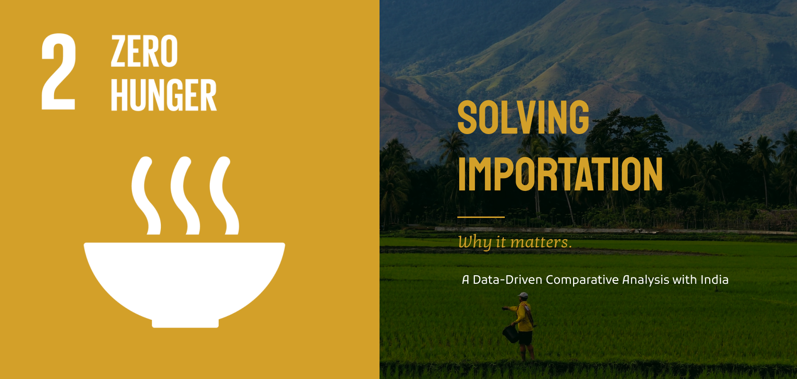

# REAP: Rice Efficacy Across Philippines: A Data-Driven Comparative Analysis with India

This project entails a comparative analysis of the agricultural practices of India and the Philippines, with a specific focus on rice cultivation. Python will be employed for data analytics. It aims to provide meaningful insights into the similarities and differences between these two methods. The project seeks to identify key factors contributing to the effectiveness of these practices while highlighting areas for potential improvement.

## Introduction
Gaitskell (1998) highlighted the tendency of developing countries to prioritize industry and urbanization over agriculture when it comes to economic development. Although there are valid arguments in favor of industry, many developing countries have now shifted towards promoting the growth of both agriculture and industry or giving priority to agriculture. The passage outlines the reasons for this change and emphasizes the urgent need to improve agriculture in developing countries. [[1]](#section1)

*Why are some countries doing better than others?*   
A study conducted by Godoy & Dewbre (2010) sought to answer the question by searching for common features among twenty-five developing nations that have accomplished remarkable progress in diminishing extreme poverty during the previous twenty to twenty-five years. The results obtained from time series and cross-section regression analysis indicate that economic growth plays a significant role in poverty reduction. However, the composition of growth, particularly the increase in agricultural incomes, is crucial in influencing the magnitude of poverty reduction. This highlights the importance of considering the sector mix of growth in poverty reduction strategies. [[2]](#section2)

Moving towards a more focused perspective, the Philippines is well-known for its agricultural lands. The Philippines has 30 million hectares of land, with nearly half (47%) dedicated to agriculture, and the most fertile agricultural areas are situated near urban and high population-density regions. To achieve food security, sustainability, social equity, and global competitiveness, the agriculture sector in the Philippines takes measures such as protecting and developing watersheds, managing agricultural land and water resources, establishing and rehabilitating irrigation systems, granting preferential access to productive assets to marginalized sectors, and providing necessary support services. [[3]](#section3)

In conclusion, agriculture remains a crucial sector for the economic development and poverty reduction of developing countries. While there has been a shift towards promoting both agriculture and industry, the increase in agricultural incomes plays a crucial role in poverty reduction. The case of the Philippines highlights the importance of protecting and developing agricultural resources to achieve food security, sustainability, social equity, and global competitiveness. However, the country's heavy reliance on imports and the challenges faced by local farmers show that more work needs to be done to improve productivity, modernize the sector, and provide adequate government support. By addressing these issues, developing countries like the Philippines can realize the potential of their agricultural resources and achieve sustainable economic growth.

## Problem Statement

  The rice industry in the Philippines faces various challenges that impact its overall efficiency and profitability. These challenges include low productivity, high input costs, and vulnerability to natural disasters. The lack of accurate and timely data on rice production, consumption, and distribution further complicates the situation. To address these issues, a data-driven comparative analysis is necessary to evaluate the efficacy of rice production in the Philippines and compare it with the rice production in India, another major rice-producing country in the world.

This study, named REAP (Rice Efficacy Across Philippines), aims to conduct a comprehensive analysis of the rice industry in the Philippines and India by collecting and analyzing data from various sources, such as government agencies, private companies, and academic institutions. Through this analysis, the study intends to identify the key factors that affect rice production in both countries and propose solutions to improve the efficiency and sustainability of rice production.

According to experts interviewed by The Straits Times, the Philippines' failure to maintain its rice self-sufficiency in subsequent years was caused by the industry's lack of modernization, the government's flawed import policies, extreme weather conditions, and a lack of support for farmers, who continue to be among the poorest people in the nation (Straits, 2023). [[4]](#section4)

Moreover, there is no infrastructure for life-saving irrigation, especially in upland and drought-prone rainfed lowland areas, and India's rice crop frequently experiences soil moisture stress as a result of irregular and insufficient rainfall. In upland soils, rainwater flows down quickly and farmers are unable to conserve the soil moisture (Status Paper - 09, n.d.). [[5]](#section5)

As rice is a staple food in the Philippines and India, understanding the efficacy of rice production in these countries is of utmost importance. The proposed study can contribute to the development of policies that promote sustainable rice production, reduce the impact of natural disasters, and ensure food security in these countries.

## Significance of the Proposed Project

Finding patterns, trends, and best practices that can be adopted or changed to match the context of the Philippine rice business can be accomplished by comparing datasets from both nations. REAP can also identify potential avenues for cooperation and information exchange between the two nations, such as collaborations in trade, research, and technology transfer.

Additionally, the application of data-driven analysis techniques, including machine learning and predictive modeling, can provide precise and valuable insights that can influence investment choices, agricultural practices, and policy-making. Both farmers and consumers in the Philippines may benefit from increased rice productivity, cost-effectiveness, and sustainability as a result of this.  

As demonstrated by all the points above, the REAP project can significantly advance the rice industry in the Philippines through data-driven comparative analysis with India. It can have a positive impact on the nation's economy and food security and offer insightful and practical solutions to the challenges faced by the industry.  

## Methods
REAP (Rice Efficacy Across the Philippines) seeks to comparatively analyze the rice industry in the Philippines and India by collecting and analyzing data from various sources, including government agencies, private businesses, and academic institutions. The data will be gathered using the secondary data collecting approach. Furthermore, data-driven comparative analysis will be utilized to generate current insights and recommendations for potential improvement. 

In addressing the shortage of accurate and timely data on rice production, consumption, and distribution, this project will collect data on various aspects of the rice industry, including but not limited to land use, production, consumption, trade, prices, inputs, and technologies employed. In addition, the project will investigate the socioeconomic factors that influence rice production, such as land tenure, labor availability, access to credit, and government policies. 

The project will utilize various datasets, including average rainfall per year, mean temperature, normalized rice production data, percentage of agricultural lands used, and forest lands, to conduct a comprehensive comparative analysis of rice production in the Philippines and India. These datasets will provide crucial information on the environmental and land-use factors impacting rice cultivation in both countries. By considering these diverse factors, the study aims to gain a holistic understanding of the complexities underlying rice production in the Philippines and India. The findings will contribute to the identification of effective strategies and policies for optimizing rice productivity, promoting sustainable land use, and ensuring the long-term viability of the rice industry in both nations.

## Expected Output

The overarching goal of the project is to analyze the rice markets in the Philippines and India, including the factors that affect or hinder rice production. The project aims to improve the efficiency and longevity of rice cultivation by collecting data and providing useful insights, such as policy recommendations and strategies. As part of this endeavor, possible channels for collaboration and information sharing between the two countries will be explored, which may involve areas such as trade, science, and technology transfer.

#### References
<a name="section1" href="https://www.cabdirect.org/cabdirect/abstract/19691800137">
[1] Importance of agriculture in economic development.</a> 
<a name="section2" href="https://d1wqtxts1xzle7.cloudfront.net/54899047/enomics_poverty-libre.pdf?1509681053=&response-content-disposition=inline%3B+filename%3DEconomic_Importance_of_Agriculture_for_P.pdf&Expires=1682270407&Signature=NydW5a4vTOJGb6u8mhwqzOrnnd4wOLbUnRdJkpeC7mbrImULg9s3W62hUdQuqZ2axYVX62CRExnTrBJ81RIWHX2BKipjiLxidHiDE~7DH6Yq-8MeP0FwJ-x-UKZq8CPF6976kpxfoCXKzAGVjRIfOLguKTbbFphgthuvR3xh4lFPdr9QFHaSLS9gx5IWbo8hd15tDYF6iRbghHIcXIbDJTrc9eRgR8fsshrPxd3NiFpg~r2bWo9Z36DLEIqnv8vOFrwWK-cTpmhqmygGqxxMdinuI5RsnmOhf6dXzPDgj7NipRZTHVc4t-OPe0PRygGn4nXhxGV6PBbcuhCRp0nuxw__&Key-Pair-Id=APKAJLOHF5GGSLRBV4ZA">
[2] Economic Importance of Agriculture for Poverty Reduction.</a> 
<a name="section3" href="https://pinas.dlsu.edu.ph/gov/agriculture.html"> [3] Agriculture </a> 
<a name="section4" href="https://www.thestar.com.my/aseanplus/aseanplus-news/2023/01/22/asian-insider---the-philippines-has-a-staple-problem-with-rice---and-its-not-going-away-soon#:~:text=Experts%20told%20The%20Straits%20Times,remain%20among%20the%20country's%20poorest."> 
[4] Asian Insider - The Philippines has a staple problem with rice – and it’s not going away soon</a> 
<a name="section5" href="https://drdpat.bih.nic.in/Status%20Paper%20-%2009.htm#:~:text=Often%20rice%20crop%20suffers%20with,drought%20prone%20rainfed%20lowland%20areas.">
[5] Rice in India : A Status Paper</a> 

